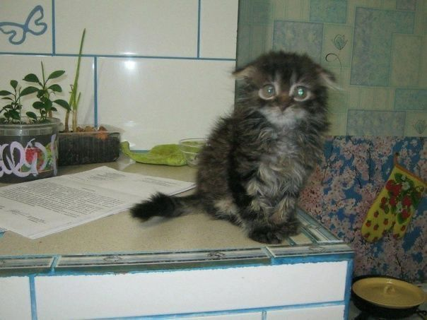
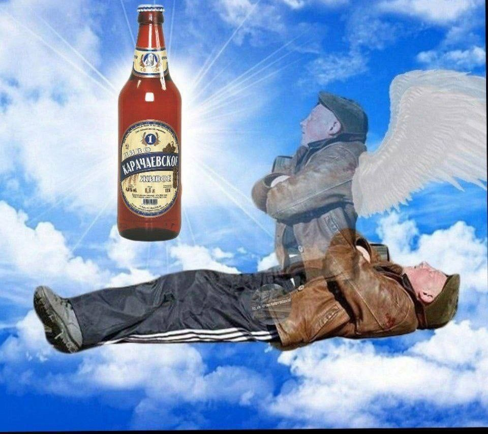
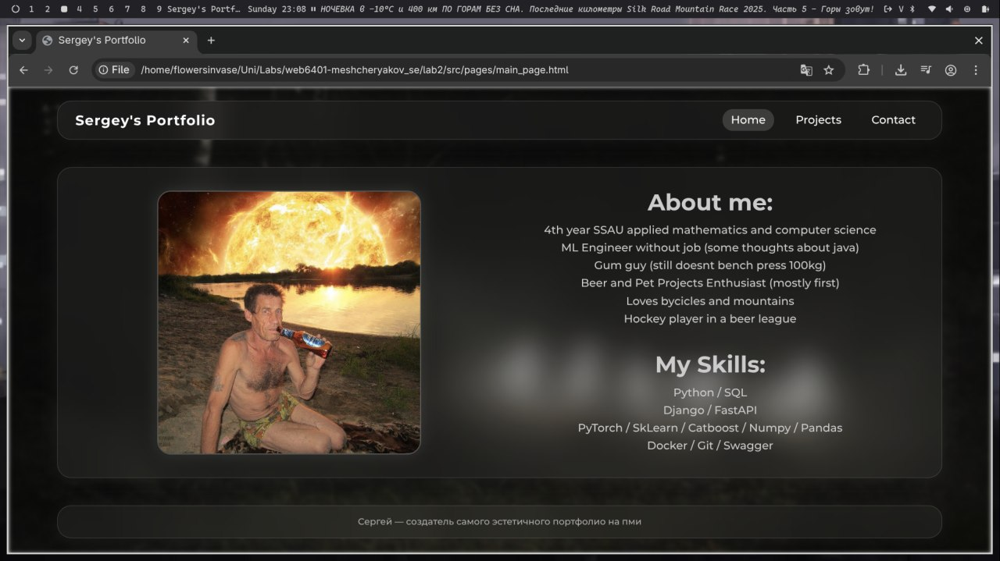
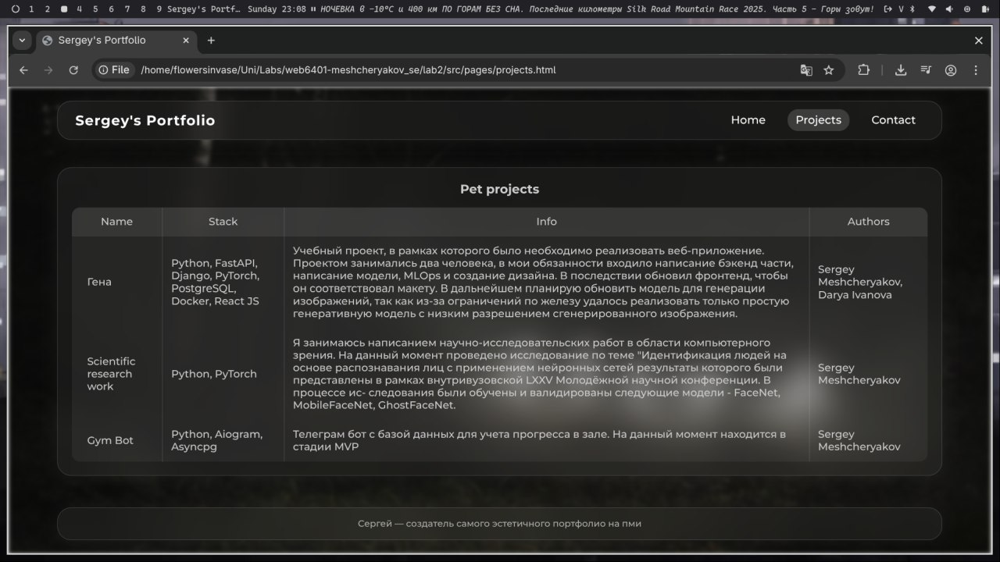
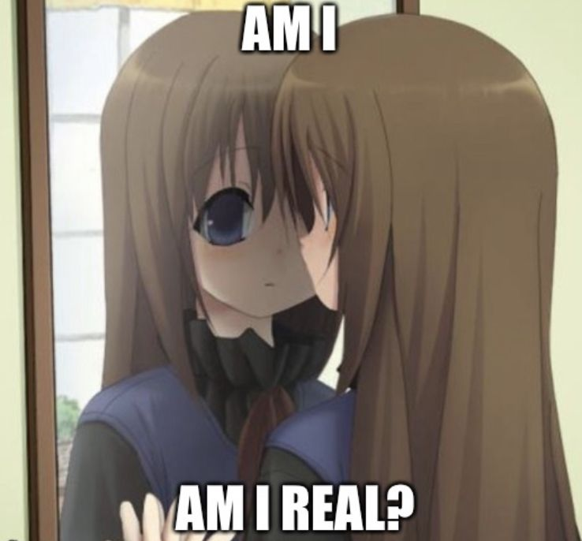
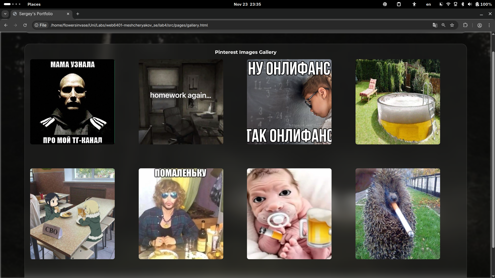
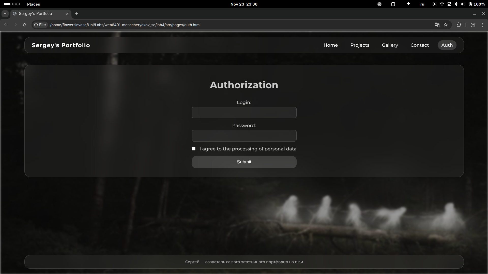

# Лабораторные работы по курсу Web-программирование

---
**ФИО:** Мещеряков Сергей Евгеньевич

**Группа:** 6401

**Научный руководитель:** Парингер Рустам Александрович

**Тема диплома:** Разработка системы безопасности для жилых комплексов с интеллектуальным видеонаблюдением (может поменяю...)

**Цитата:** Нам суждено терять людей, которых мы любим. Как иначе узнать, насколько они важны для нас?

---

# Lab 2

## Changelog

1. 3 НОВЫХ НЕВЕРОЯТНЫХ странички

## Screenshots

### НЕВЕРОЯТНАЯ главная страница

### НЕВЕРОЯТНАЯ страница с НЕВЕРОЯТНЫМИ проектами

### НЕВЕРОЯТНАЯ страница с моими контактами

НЕ БУДЕТ !!!! она страшная получилась

# Lab 3

Всё сделано...

# Lab 4

## Changelog

1. Вёрстка с помощью Flexbox – 1 страница.
2. Вёрстка с помощью Grid – 1 страница.
3. Задание всех цветов только с помощью переменных в CSS.
4. Реализация анимации (красивой!) с помощью CSS – 1шт.
5. Реализация страницы с формой, включающей не менее 3 различных типов полей (например, страница авторизации с вводом логина, пароля и галочкой-согласием на обработку данных) и кнопку отправки данных на сервер.
6. Создание класса, содержащего конструктор и метод форматированного вывода на консоль. При нажатии на кнопку отправки данных на сервер должен создаваться объект, хранящий введённые данные, после чего вызывается метод вывода на консоль.

## Screenshots

### НЕВЕРОЯТНАЯ страница с картинками (здесь GRID)

### НЕВЕРОЯТНАЯ страница с НЕВЕРОЯТНЫМИ формочками

