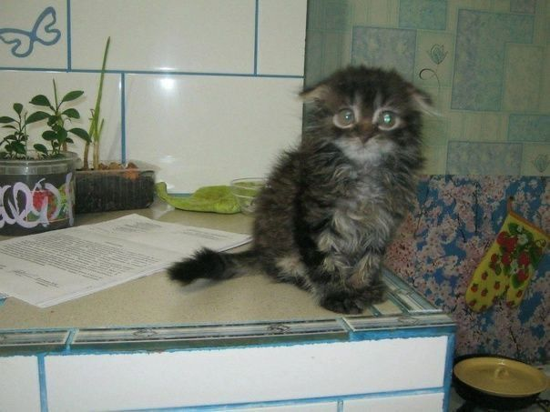

# Лабораторные работы по курсу Web-программирование

---
**ФИО:** Мещеряков Сергей Евгеньевич

**Группа:** 6401

**Научный руководитель:** Парингер Рустам Александрович

**Тема диплома:** Разработка системы безопасности для жилых комплексов с интеллектуальным видеонаблюдением (может поменяю...)

**Цитата:** Нам суждено терять людей, которых мы любим. Как иначе узнать, насколько они важны для нас?

---

